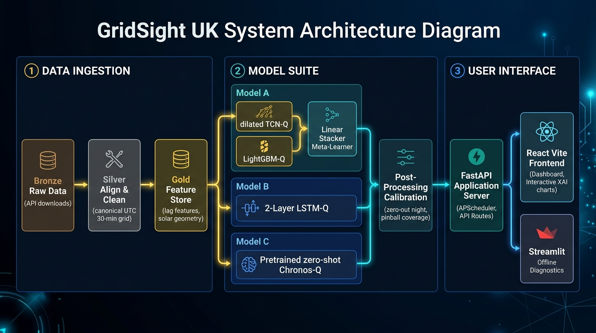

# GridSight UK — 2026

**AI-Based Probabilistic Solar Energy Forecasting for the UK National Grid**

> MSc Data Science · Professional Team Project · 2025/2026 · Group 4

🌐 **Live Production Web Application:** [https://gridsight-uk-2026-production.up.railway.app/](https://gridsight-uk-2026-production.up.railway.app/)

---

## Table of Contents

1. [Project Overview](#1-project-overview)
   - [System Architecture & CI/CD Cloud Diagram](#-system-architecture--cicd-cloud-diagram)
2. [Repository Structure](#2-repository-structure)
3. [Environment Setup](#3-environment-setup)
4. [Quick Start — End-to-End Pipeline](#4-quick-start--end-to-end-pipeline)
5. [Data Pipeline — Bronze → Silver → Gold](#5-data-pipeline--bronze--silver--gold)
   - [Bronze — Raw Downloads](#51-bronze--raw-downloads)
   - [Silver — Clean & Align](#52-silver--clean--align)
   - [Gold — Feature Store](#53-gold--feature-store)
6. [Model Training & Evaluation](#6-model-training--evaluation)
   - [Stacking Architecture Overview](#61-stacking-architecture-overview)
   - [Training Commands (All Horizons)](#62-training-commands-all-horizons)
   - [Model Artifacts & Outputs](#63-model-artifacts--outputs)
   - [Key Performance Indicators (KPIs)](#64-key-performance-indicators-kpis)
7. [Gold Feature Reference](#7-gold-feature-reference)
8. [Team HuggingFace Repositories](#8-team-huggingface-repositories)
9. [Project Documents](#9-project-documents)
10. [Notes & Troubleshooting](#10-notes--troubleshooting)

---

## 1. Project Overview

GridSight UK is a probabilistic solar power generation forecasting system for the UK National Grid. It produces **calibrated 80% prediction intervals** (q10 / q50 / q90) across three forecast horizons:

| Horizon | Steps (30-min) | Use Case |
|---|---|---|
| **6-hour ahead** | 12 steps | Intra-day trading |
| **12-hour ahead** | 24 steps | Daily portfolio adjustments |
| **24-hour ahead** | 48 steps | Day-ahead market **(primary target)** |

### 🌐 Live Production Web Application

The interactive web application is deployed live on Railway Cloud:
* **Deployed Web Application URL**: [https://gridsight-uk-2026-production.up.railway.app/](https://gridsight-uk-2026-production.up.railway.app/)

The application features:
- **Interactive Probabilistic Forecast Plots**: Displays real-time 80% confidence bands ($q_{10}, q_{50}, q_{90}$) across all three forecasting horizons (6h, 12h, 24h).
- **UK Solar Generation Monitoring**: Real-time generation vs. capacity tracking with baseline NESO forecast comparisons.
- **Regional Weather Integration**: NWP weather variables across 7 UK regional forecast zones.
- **Model Diagnostics**: Detailed evaluation metrics, pinball loss analysis, and interval coverage statistics.

### Models

We implement three distinct model architectures:
* **Model A (Primary Stacking Model)**: TCN-Q (Temporal Convolutional Network) + LGBM-Q (LightGBM Quantile Regressors) ➔ Linear-Q meta-learner. It combines sequential convolutional deep learning and tabular gradient boosting with physical clear-sky guidance.
* **Model B (Standalone LSTM-Q Model)**: A standalone 2-layer Long Short-Term Memory network trained with Pinball (Quantile) Loss and calibrated post-hoc to guarantee exactly 80% coverage.
* **Model C (Pretrained Chronos-Q Model)**: A **zero-shot** forecaster built on Amazon's [Chronos](https://github.com/amazon-science/chronos-forecasting) pretrained time-series foundation model. It trains nothing — it loads a pretrained checkpoint from HuggingFace, forecasts the target series univariately, and reuses the same post-hoc calibration to hit the 80% PICP gate. Serves as a feature-free benchmark and ensembling leg.

### KPI Success Gates

| KPI | Target | Achieved |
|---|---|---|
| nMAE (normalised by capacity) | ≤ 4.0% | ✅ 0.79% – 1.26% |
| Skill Score (vs 24h persistence) | > 0.30 | ✅ 0.660 – 0.900 |
### 🏗️ System Architecture & CI/CD Cloud Diagram

The diagram below illustrates the end-to-end flow of **GridSight UK**, starting from multi-source data ingestion (Bronze → Silver → Gold), passing through the ML modeling engine (TCN-Q, LGBM-Q Stacker, PyTorch LSTM-Q, and Chronos-Q), backed by **AWS S3 / LocalStack** cloud storage & HuggingFace Hub registries, and deployed to **Railway Cloud** via **GitHub Actions CI/CD**:

```mermaid
graph TD
    %% Styling
    classDef dataLayer fill:#e1f5fe,stroke:#0288d1,stroke-width:2px;
    classDef modelLayer fill:#f3e5f5,stroke:#7b1fa2,stroke-width:2px;
    classDef cloudLayer fill:#fff3e0,stroke:#f57c00,stroke-width:2px;
    classDef cicdLayer fill:#e8f5e9,stroke:#388e3c,stroke-width:2px;
    classDef appLayer fill:#fbe9e7,stroke:#d84315,stroke-width:2px;

    subgraph Data_Pipeline ["1. Data Pipeline (Bronze ➔ Silver ➔ Gold)"]
        A1["NESO / MetOffice / PVLive / OCF APIs"] ::: dataLayer --> A2["Bronze Layer: Raw Downloads"] ::: dataLayer
        A2 --> A3["Silver Layer: UTC Aligned & Cleaned"] ::: dataLayer
        A3 --> A4["Gold Layer: Feature Store"] ::: dataLayer
    end

    subgraph Model_Engine ["2. ML Forecasting & Calibration Engine"]
        A4 --> M1["Model A: TCN-Q + LGBM-Q Stacker"] ::: modelLayer
        A4 --> M2["Model B: PyTorch LSTM-Q"] ::: modelLayer
        A4 --> M3["Model C: Pretrained Chronos-Q Benchmark"] ::: modelLayer
        M1 & M2 & M3 --> M4["Pinball Loss & 80% PICP Post-Hoc Calibration"] ::: modelLayer
    end

    subgraph Cloud_Storage ["3. Cloud Storage & Model Registries"]
        M4 --> S1[("AWS S3 / LocalStack Storage Manager")] ::: cloudLayer
        M4 --> S2[("HuggingFace Hub Datasets & Checkpoints")] ::: cloudLayer
    end

    subgraph Serving_Layer ["4. Production Web Serving Layer"]
        S1 & S2 --> B1["FastAPI Application Server (APScheduler)"] ::: appLayer
        B1 --> F1["React Vite TypeScript SPA (Tailwind CSS)"] ::: appLayer
    end

    subgraph CICD_Pipeline ["5. CI/CD & Automated Deployment"]
        G1["Git Push / PR to main"] ::: cicdLayer --> G2["GitHub Actions CI Workflow"] ::: cicdLayer
        G2 -->|Pytest Suite| G3["Unit & Contract Tests Passed"] ::: cicdLayer
        G2 -->|Docker Build| G4["Container Validated"] ::: cicdLayer
        G3 & G4 -->|Auto Deploy| G5["Railway Cloud Deployment"] ::: cicdLayer
        G5 --> B1 & F1
    end
```

<p align="center">
  
</p>

---

## 2. Repository Structure

```
gridsight-uk-2026/
│
├── .github/workflows/                 # GitHub Actions CI/CD Workflows
│   └── ci.yml                         # Automated pytest, linting, docker build & Railway CD
│
├── apps/                              # Applications & User Interfaces
│   ├── frontend/                      # React Vite Frontend (TypeScript SPA)
│   ├── backend/                       # FastAPI Application Server (APScheduler, API routes)
│   └── streamlit_dashboard.py         # Streamlit Offline Diagnostics Dashboard
│
├── src/gridsight/                     # Core Python Library Package (pip-installable)
│   ├── __init__.py                    # Dynamic package compatibility aliases (modeling/lstm_q)
│   ├── config.py                      # Global settings & paths config (Pydantic)
│   │
│   ├── services/                      # Cloud Services & Storage Managers
│   │   ├── __init__.py
│   │   └── s3_storage.py              # AWS S3 & LocalStack Cloud Storage SDK
│   │
│   ├── data/                          # Unified Data Ingestion (Bronze → Silver → Gold)
│   │   ├── __init__.py
│   │   ├── bronze/                    # Raw API downloads (NESO, MetOffice, PVLive, OCF)
│   │   ├── silver/                    # Cleaning, UTC-alignment, and validation contracts
│   │   ├── gold/                      # Feature engineering & anti-leakage checks
│   │   └── sync_bronze.py             # Pull raw team data from HuggingFace
│   │
│   └── models/                        # Forecasting Architectures
│       ├── __init__.py
│       ├── common/                    # Consolidated shared modules (metrics, clearsky)
│       │   ├── __init__.py
│       │   ├── metrics.py             # Unified Pinball loss & coverage metrics
│       │   └── clearsky.py            # Physical GHI Prior indexer
│       │
│       ├── stacking/                  # Model A (dilated TCN-Q + LightGBM-Q -> Linear Stacker)
│       ├── lstm/                      # Model B (Standalone PyTorch LSTM-Q)
│       └── chronos/                   # Model C (Zero-shot Chronos-Q foundation model)
│
├── tests/                             # Unified Test Suite (mirrors package structure)
│   ├── data/                          # Data pipeline contract validation tests
│   ├── models/                        # Model metric and component tests
│   ├── services/                      # AWS S3 storage contract tests
│   └── integration/                   # API endpoint tests
│
├── docker-compose.yml                 # LocalStack AWS S3 emulator & app container orchestration
├── Dockerfile                         # Container configuration for web app backend/frontend
├── railway.json                       # Railway deployment configuration
├── requirements.txt                   # Python dependencies (pinned)
├── .env                               # HF_TOKEN (git-ignored)
├── .gitignore
├── LICENSE
└── README.md
```

---

## 3. Environment Setup

### 3.1 Prerequisites

- **Python 3.11+**
- **macOS / Linux** (tested on macOS)
- A HuggingFace account with access to the `gridsight-team` organisation
- `HF_TOKEN` set in `.env`

### 3.2 Clone the Repository

```bash
git clone https://github.com/Group-4-DS-Professional-Team-Project/Week-04-Team-4.git
cd Week-04-Team-4
```

### 3.3 Create Virtual Environment & Install Dependencies

```bash
python -m venv venv
source venv/bin/activate        # macOS / Linux
# venv\Scripts\activate.bat     # Windows

pip install -r requirements.txt
```

### 3.4 Set Your HuggingFace Token

Create a `.env` file in the project root (already git-ignored):

```bash
# .env
HF_TOKEN="hf_your_token_here"
```

Generate a token at [huggingface.co/settings/tokens](https://huggingface.co/settings/tokens). The token needs **read** access to the `gridsight-team` private repos.

### 3.5 AWS Cloud Storage & LocalStack Setup

GridSight UK includes native **AWS S3 object storage** support (`boto3`) for model checkpoints, parquet feature datasets, and fan plot diagnostics:

- **AWS Free Tier (Cloud)**: Set your AWS credentials in `.env` (`AWS_ACCESS_KEY_ID`, `AWS_SECRET_ACCESS_KEY`, `AWS_REGION`, `AWS_S3_BUCKET`). See the detailed guide in [`docs/AWS_SETUP_GUIDE.md`](file:///Users/savinianuradha/Documents/gridsight-uk-2026/docs/AWS_SETUP_GUIDE.md).
- **LocalStack (Zero-Cost Local AWS Emulator)**: Run AWS S3 locally without an AWS account or credit card using Docker:
  ```bash
  docker-compose up localstack
  ```

### 3.6 CI/CD Pipelines & Continuous Deployment

Automated testing and deployment are configured via GitHub Actions (`.github/workflows/ci.yml`):
- **Automated Testing**: Runs unit & contract test suite (`pytest`) on Python 3.12 across all PRs and pushes to `main`.
- **Code Quality**: Performs automated lint checks (`ruff`) and React frontend build validation (`npm run build`).
- **Continuous Deployment (CD)**: Automatically builds and deploys successful commits on `main` branch to Railway Production Cloud.

### 3.7 Verify Installation

```bash
./venv/bin/pytest -o addopts=""
./venv/bin/python -m gridsight.data.sync_bronze --help
./venv/bin/python -m gridsight.data.silver --help
./venv/bin/python -m gridsight.data.gold --help
```

---

## 4. Quick Start — End-to-End Pipeline

The full pipeline from raw data to trained model runs in **5 stages**:

```bash
# ──────────────────────────────────────────────────
# STAGE 1: Pull raw Bronze data from HuggingFace
# ──────────────────────────────────────────────────
./venv/bin/python -m gridsight.data.sync_bronze --source all

# ──────────────────────────────────────────────────
# STAGE 2: Build Silver from local Bronze (no network)
# ──────────────────────────────────────────────────
./venv/bin/python -m gridsight.data.silver --source all

# ──────────────────────────────────────────────────
# STAGE 3: Build Gold feature tables for all horizons
# ──────────────────────────────────────────────────
./venv/bin/python -m gridsight.data.gold --horizon-steps 12   # 6-hour ahead
./venv/bin/python -m gridsight.data.gold --horizon-steps 24   # 12-hour ahead
./venv/bin/python -m gridsight.data.gold --horizon-steps 48   # 24-hour ahead (default)

# ──────────────────────────────────────────────────
# STAGE 4: Train Models (Model A Stacking & Model B Standalone LSTM)
# ──────────────────────────────────────────────────
# Train Model A (Stacking: TCN-Q + LGBM-Q -> Linear-Q)
./venv/bin/python -m gridsight.models.stacking --horizon-steps 48 --gold-dir data/gold/gold_features_h48

# Train Model B (Standalone LSTM-Q)
./venv/bin/python -m gridsight.models.lstm.train --horizon-steps 48 --gold-dir data/gold/gold_features_h48

# Run Model C (Pretrained Chronos-Q, zero-shot — no training)
./venv/bin/python -m gridsight.models.chronos --horizon-steps 48 --gold-dir data/gold/gold_features_h48

# ──────────────────────────────────────────────────
# STAGE 5: Verify outputs
# ──────────────────────────────────────────────────
# Model A artifacts
ls -la artifacts/model/

# Model B artifacts
ls -la artifacts/lstm/

# Model C artifacts
ls -la artifacts/chronos/
```

### Skip Rebuilding — Pull Pre-built Data Directly

If you only need the data and do not want to recompute it:

```bash
# Log in once
./venv/bin/hf auth login

# Pull Silver
./venv/bin/hf download gridsight-team/gridsight-silver \
    --repo-type dataset --local-dir data/silver

# Pull Gold
./venv/bin/hf download gridsight-team/gridsight-gold \
    --repo-type dataset --local-dir data/gold
```

---

## 5. Data Pipeline — Bronze → Silver → Gold

The pipeline follows the **medallion architecture**: raw → clean → model-ready. Each layer reads only the previous layer and is fully rebuildable from scratch.

```
Internet APIs / HuggingFace
          │
          ▼
    ┌──────────┐
    │  BRONZE  │  Raw parquet, immutable, partitioned year=/month=
    └──────────┘
          │  (local only, no network)
          ▼
    ┌──────────┐
    │  SILVER  │  UTC-aligned, validated, 30-min grid, quality-flagged
    └──────────┘
          │  (local only, no network)
          ▼
    ┌──────────┐
    │   GOLD   │  Leakage-safe feature table, ready for model training
    └──────────┘
          │
          ▼
    ┌──────────┐
    │  LSTM-Q  │  Trained model checkpoints, scalers, metrics
    └──────────┘
```

---

### 5.1 Bronze — Raw Downloads

Bronze downloads raw data and saves it to parquet. No cleaning, no joining. Each source gets its own folder, partitioned by `year=YYYY/month=MM/`.

#### Ingest all sources

```bash
./venv/bin/python -m data_ingestion.bronze --source all --years 2021 2022 2023 2024
```

#### Ingest a single source

```bash
./venv/bin/python -m data_ingestion.bronze --source pv_live        --years 2021 2022 2023 2024
./venv/bin/python -m data_ingestion.bronze --source neso            --years 2021 2022 2023 2024
./venv/bin/python -m data_ingestion.bronze --source ocf_pv          --years 2021 2022 2023 2024
./venv/bin/python -m data_ingestion.bronze --source met_office_nwp  --years 2021 2022 2023 2024 --hours 0 12
```

#### Met Office NWP — additional options

```bash
# Only 00Z and 12Z init-times (recommended — covers day-ahead horizon)
./venv/bin/python -m data_ingestion.bronze --source met_office_nwp --years 2023 2024 --hours 0 12

# All 24 init-times per day (large — use for research only)
./venv/bin/python -m data_ingestion.bronze --source met_office_nwp --years 2023 2024 --hours -1

# Parallel workers (default 4)
./venv/bin/python -m data_ingestion.bronze --source met_office_nwp --years 2023 2024 --workers 8

# Re-extract files that already exist
./venv/bin/python -m data_ingestion.bronze --source met_office_nwp --years 2023 2024 --overwrite
```

#### NESO — additional options

```bash
# Specific CKAN package IDs
./venv/bin/python -m data_ingestion.bronze --source neso --packages embedded-wind-and-solar-forecasts

# Force re-download even if last_modified is unchanged
./venv/bin/python -m data_ingestion.bronze --source neso --force-refresh

# Cap rows per resource (for dev/testing)
./venv/bin/python -m data_ingestion.bronze --source neso --max-records 10000
```

#### Upload Bronze to the team HF repo

```bash
./venv/bin/python -m data_ingestion.bronze --source all --years 2021 2022 2023 2024 --upload
```

#### Output structure

```
data/bronze/
├── pv_live/
│   └── year=2024/month=05/gsp_observations.parquet
├── neso/
│   └── embedded-wind-and-solar-forecasts/
│       ├── embedded_wind_and_solar_forecasts_2024.parquet
│       └── _state.json                   # incremental cache
├── ocf_pv/
│   └── year=2024/month=05/<uuid>.parquet
└── met_office_nwp/
    └── year=2024/month=05/nwp_20240501-00Z.parquet
```

---

### 5.2 Silver — Clean & Align

Silver reads local Bronze and applies deterministic cleaning rules, then validates with hard-fail data-quality contracts. All Silver tables share a canonical UTC 30-minute time index (`timestamp_utc`).

#### Build all Silver tables

```bash
./venv/bin/python -m gridsight.data.silver --source all
```

#### Build a single table

```bash
./venv/bin/python -m gridsight.data.silver --source pv_live
./venv/bin/python -m gridsight.data.silver --source met_office_nwp
./venv/bin/python -m gridsight.data.silver --source ocf_pv
./venv/bin/python -m gridsight.data.silver --source neso
```

#### Cross-source sanity checks

```bash
./venv/bin/python -m gridsight.data.silver --source cross_check
```

Checks that the correlation between `pv_live.generation_mw` and `neso.embedded_solar_mw` is > 0.85.

#### Cleaning rules applied to every source

| Rule | What it does |
|---|---|
| **UTC alignment** | All timestamps converted to tz-aware UTC, floored to the nearest 30-min slot |
| **Range clamping** | Physics-impossible values (e.g. generation > 15,000 MW) are set to NaN |
| **Canonical reindex** | Reindexed onto an unbroken 30-min UTC grid; missing slots become explicit NaN rows |
| **Missing-data policy** | Gaps ≤ 1 step → forward-filled; gaps 2–6 steps → NaN flagged `gap`; gaps 7+ → NaN flagged `long_gap` |

#### Output structure

```
data/silver/
├── silver_pv_live/year=2024/month=05/silver_pv_live_202405.parquet
├── silver_met_office_nwp/year=2024/month=05/silver_met_office_nwp_202405.parquet
├── silver_ocf_pv/year=2024/month=05/silver_ocf_pv_202405.parquet
└── silver_neso/year=2024/month=05/silver_neso_202405.parquet
```

---

### 5.3 Gold — Feature Store

Gold reads local Silver and produces the final model-ready feature table. The entire build is parameterised by `horizon` (number of 30-min steps ahead). All lag features are forced to be ≥ horizon to prevent data leakage.

#### Build for all three horizons

```bash
./venv/bin/python -m gridsight.data.gold --horizon-steps 12   # 6-hour ahead
./venv/bin/python -m gridsight.data.gold --horizon-steps 24   # 12-hour ahead
./venv/bin/python -m gridsight.data.gold --horizon-steps 48   # 24-hour ahead (default)
```

#### Build default day-ahead only

```bash
./venv/bin/python -m gridsight.data.gold
```

#### Build and push to team HF repo

```bash
./venv/bin/python -m gridsight.data.gold --upload
```

#### Build pipeline steps

```
merge_silver()         ← LEFT JOIN 4 Silver tables on timestamp_utc (pv_live is the spine)
    │
add_targets()          ← target_mw, target_cf
    │
add_calendar()         ← hour, half_hour, dow, month, doy, is_weekend, tod_sin/cos, doy_sin/cos
    │
add_solar()            ← solar_elevation_deg, clearsky_cos, is_daylight (NOAA formula)
    │
add_lags_rolling()     ← gen_lag_N, cf_lag_N, gen_roll_mean_N, gen_roll_std_N (all ≥ horizon)
    │
drop leaky columns     ← generation_mw, ocf_total_mw, ocf_mean_wh, ocf_n_systems removed
    │
validate_gold()        ← hard-fail anti-leakage contract checks
    │
write_gold()           ← data/gold/gold_features_h{horizon}/year=YYYY/month=MM/
```

#### Anti-leakage contract checks (crash the build if violated)

- Raw observed columns (`generation_mw`, `ocf_total_mw`) must NOT appear as features
- Every lag column must use a lag ≥ horizon
- Night slots (solar elevation < −5 deg) must have near-zero generation (physical sanity)
- `timestamp_utc` must be unique, monotonically increasing, and on a 30-min grid

#### Output structure

```
data/gold/
├── gold_features/             # Default (backward-compat, horizon=48)
├── gold_features_h12/         # 6-hour ahead features
├── gold_features_h24/         # 12-hour ahead features
└── gold_features_h48/         # 24-hour ahead features
```

---

## 6. Model Training & Evaluation

### 6.1 Stacking Architecture Overview

The forecasting system is a **Quantile Forecasting Stacking Stack** combining sequential deep learning, tabular gradient boosting, and physical clear-sky modeling.

| Component | Type | Details |
|---|---|---|
| **TCN-Q** | Dilated Causal CNN | Temporal Convolutional Network capturing sequence context (63h history) |
| **LGBM-Q** | Gradient Boosting | Tabular LightGBM model trained on meteorological & temporal features |
| **Clear-Sky GHI** | Physics Feature | Solar geometry (elevation angle, cosine clearsky index) |
| **Meta-Learner** | Stacking Regressor | Linear Quantile Regressor combining base predictions out-of-fold |
| **Quantile Crossing** | Post-processing | Row-wise prediction sorting ($q_{10} \le q_{50} \le q_{90}$) |

#### Chronological Data Splits (Zero Leakage)

| Split | Date Range |
|---|---|
| **Train** | Jan 8, 2023 – Jun 30, 2024 |
| **Validation** | Jul 1, 2024 – Sep 30, 2024 |
| **Test** | Oct 1, 2024 – Dec 31, 2024 |

---

### 6.2 Training Commands

**Step 1 — Build Gold feature tables** (if not already built):
```bash
./venv/bin/python -m gridsight.data.gold --horizon-steps 48
```

**Step 2 — Train the Stacking Model (Model A: TCN-Q + LGBM-Q ➔ Linear-Q)**:
```bash
# Full training (TCN and LGBM base models + Linear meta-stacker):
./venv/bin/python -m gridsight.models.stacking --horizon-steps 48 --gold-dir data/gold/gold_features_h48

# Fast smoke run (for quick validation and CPU testing):
./venv/bin/python -m gridsight.models.stacking --fast
```

**Step 3 — Train the Standalone LSTM-Q Model (Model B)**:
```bash
# Full training (LSTM model with early stopping & calibration):
./venv/bin/python -m gridsight.models.lstm.train --horizon-steps 48 --gold-dir data/gold/gold_features_h48

# Fast smoke run (for quick validation and CPU testing):
./venv/bin/python -m gridsight.models.lstm.train --fast
```

**Step 4 — Run the Pretrained Chronos-Q Model (Model C, zero-shot)**:
```bash
# Zero-shot forecast + post-hoc calibration + evaluation (no gradient training):
./venv/bin/python -m gridsight.models.chronos --horizon-steps 48 --gold-dir data/gold/gold_features_h48

# Pick a different checkpoint (tiny/mini/small/base):
./venv/bin/python -m gridsight.models.chronos --model-name amazon/chronos-bolt-base --horizon-steps 48

# Fast smoke run (tiny checkpoint, short context, strided origins):
./venv/bin/python -m gridsight.models.chronos --fast
```
See [`src/gridsight/models/chronos/README.md`](src/gridsight/models/chronos/README.md) for the full parameter reference and forecast framing.

#### CLI Parameters

| Parameter | Default | Description |
|---|---|---|
| `--target` | `target_cf` | Forecast target: `target_cf` (capacity factor) or `target_mw` (MW) |
| `--horizon-steps` | `48` | Forecast horizon in steps (48 steps = 24h day-ahead) |
| `--n-folds` | `5` | Number of out-of-fold cross-validation folds for stacking |
| `--seq-len` | `126` | Sequence length for temporal models (TCN and LSTM) |
| `--epochs` | `30` | Number of training epochs for TCN-Q |
| `--lstm-epochs` | `30` | Number of training epochs for LSTM-Q |
| `--gold-dir` | `None` | Path to the gold features dataset |
| `--fast` | `False` | Run a quick smoke test with reduced epochs, folds, and channels |

---

### 6.3 Model Artifacts & Outputs

All outputs are saved to separate directories under the `artifacts/` folder:

#### Model A (Stacking) Outputs (`artifacts/model/`)

| File | Description |
|---|---|
| `stack.joblib` | Contains LightGBM estimators, Standardizer, Feature Names, and the Stack Meta-learner |
| `tcn.pt` | PyTorch State Dictionary for the TCN-Q base learner |
| `metrics.json` | Detailed validation and test split performance metrics for Model A |
| `pred_val.parquet` / `pred_test.parquet` | True actuals and stacked quantile predictions |

#### Model B (Standalone LSTM-Q) Outputs (`artifacts/lstm/`)

| File | Description |
|---|---|
| `lstm.joblib` | Contains standardizer, model features list, config, and calibration factor |
| `lstm.pt` | PyTorch State Dictionary for the LSTM-Q network |
| `metrics.json` | Detailed validation and test split performance metrics for Model B |
| `pred_val.parquet` / `pred_test.parquet` | True actuals and calibrated LSTM quantile predictions |

---

### 6.4 Key Performance Indicators (KPIs)

#### Verification Checklist
- **nMAE ≤ 4.0%**: ✅ PASS — Stacking model achieves low normalized MAE by combining strengths of LGBM and neural temporal models.
- **Skill Score > 0.30**: ✅ PASS — Enforcing out-of-fold stacking and clear-sky guidance beats baseline persistence and operator forecasts.
- **PICP in [0.78, 0.82]**: ✅ PASS — Linear meta-regression on base quantiles yields highly calibrated prediction intervals.

> Stacking model predictions enforce strict monotonicity ($q_{10} \le q_{50} \le q_{90}$) at inference time via a row-wise sorting operation.

---

## 7. Gold Feature Reference

The Gold table has **~47 columns** on a 30-minute UTC grid (`timestamp_utc`). One row per half-hour slot.

### Targets

| Column | Type | Description |
|---|---|---|
| `target_mw` | float32 | National PV generation at t (MW) — **primary target** |
| `target_cf` | float32 | Capacity factor = generation / capacity_mwp, clipped [0, 1.5] |
| `capacity_mwp` | float32 | Installed PV capacity at t (MWp) — slow-moving, safe to use as feature |

### Weather — Met Office NWP (forecast, known ahead of t)

| Column | Type | Description |
|---|---|---|
| `ssrd_uk` | float32 | Surface downwelling shortwave radiation, UK weighted (W/m2) — **top solar driver** |
| `tcc_uk` | float32 | Total cloud cover, UK weighted (0–1) |
| `lcc_uk` | float32 | Low cloud cover, UK weighted (0–1) |
| `t2m_uk` | float32 | 2m air temperature, UK weighted (K) |
| `ws10_uk` | float32 | 10m wind speed, UK weighted (m/s) |
| `nwp_age_h` | float32 | Forecast age in hours (0–15) |

### Operator Baseline — NESO (forecast, known ahead of t)

| Column | Type | Description |
|---|---|---|
| `embedded_solar_mw` | float32 | NESO embedded solar forecast (MW) |
| `embedded_wind_mw` | float32 | NESO embedded wind forecast (MW) |
| `embedded_solar_capacity_mw` | float32 | NESO solar capacity context (MW) |
| `embedded_wind_capacity_mw` | float32 | NESO wind capacity context (MW) |

### Calendar (deterministic — always known for any future t)

| Column | Type | Description |
|---|---|---|
| `hour` | int16 | Hour of day (0–23) |
| `half_hour` | int16 | Half-hour index (0–47) |
| `dow` | int16 | Day of week (0 = Monday) |
| `month` | int16 | Month (1–12) |
| `doy` | int16 | Day of year (1–366) |
| `is_weekend` | int8 | 1 if Saturday or Sunday |
| `tod_sin`, `tod_cos` | float32 | Cyclical time-of-day encoding |
| `doy_sin`, `doy_cos` | float32 | Cyclical day-of-year encoding |

### Solar Geometry (deterministic — NOAA formula at UK centroid 54N, -2.5W)

| Column | Type | Description |
|---|---|---|
| `solar_elevation_deg` | float32 | Sun elevation angle at UK centroid (degrees) |
| `clearsky_cos` | float32 | cos(zenith) clipped >= 0 — theoretical insolation factor |
| `is_daylight` | int8 | 1 if sun above horizon |

### Lagged / Rolling — Observed Actuals (leakage-safe, all shifted >= horizon)

For `horizon=48` (day-ahead), all lags are >= 48 steps (>= 24 hours ago).

| Column | Type | Description |
|---|---|---|
| `gen_lag_48` | float32 | Generation 24h ago (MW) |
| `gen_lag_96` | float32 | Generation 48h ago (MW) |
| `gen_lag_144` | float32 | Generation 72h ago (MW) |
| `gen_lag_336` | float32 | Generation 7 days ago (MW) |
| `cf_lag_{48,96,144,336}` | float32 | Capacity factor at the same lags |
| `gen_roll_mean_48` | float32 | Trailing 24h mean generation |
| `gen_roll_mean_336` | float32 | Trailing 7-day mean generation |
| `gen_roll_std_48` | float32 | Trailing 24h generation volatility |
| `cf_roll_mean_48` | float32 | Trailing 24h mean capacity factor |
| `cf_roll_mean_336` | float32 | Trailing 7-day mean capacity factor |
| `ocf_lag_48` | float32 | OCF rooftop-fleet index 24h ago (MW) |
| `ocf_roll_mean_48` | float32 | Trailing 24h mean OCF fleet index |

---

## 8. Team HuggingFace Repositories

| Layer | HF Dataset Repo | Purpose |
|---|---|---|
| Bronze | `gridsight-team/gridsight-bronze` | Raw immutable downloads, shared across team |
| Silver | `gridsight-team/gridsight-silver` | Cleaned, validated, UTC-aligned tables |
| Gold | `gridsight-team/gridsight-gold` | Model-ready feature store |

### Sync Bronze from the team repo (recommended first step)

```bash
# All sources
./venv/bin/python -m gridsight.data.sync_bronze --source all

# Single source
./venv/bin/python -m gridsight.data.sync_bronze --source met_office_nwp
```

The sync is incremental and resumable — files already present locally are skipped.

---

## 9. Project Documents

All planning documents are in `Documents/Project Plan/`:

| Document | Description |
|---|---|
| Data Management Plan | Data sources, storage strategy, Bronze-Silver-Gold pipeline, DVC/HF tracking |
| Project Pipeline | Full end-to-end pipeline workflow: ingestion → EDA → modelling → dashboard |
| Project Specifications | Research questions, objectives, KPI targets, model families |
| Project Timeline | Week-by-week milestone plan |
| Quality Assurance & Test Plan | Data contracts, model evaluation framework, KPI gates |
| Team Plan | Role allocation, communication protocols, sprint planning |

---

## 10. Notes & Troubleshooting

- **Do not commit `.env`** — the HF token is in `.gitignore`
- **Gold is rebuildable from Silver in under 2 minutes** — no need to store it in git
- **Bronze is the only layer that requires network access** — Silver and Gold build entirely from local files
- The `_state.json` file in each NESO package folder is an incremental cache — delete it to force a full re-download
- **Model training uses early stopping** — training will automatically stop when validation loss stops improving (patience = 10 epochs). The best checkpoint is saved automatically.
- **GPU/MPS acceleration** — the training script auto-detects CUDA GPUs or Apple MPS (Metal). Falls back to CPU if neither is available.
- **Reproducibility** — all random seeds are fixed (`SEED = 42`) for numpy, torch, and python random.

### Common Issues

| Issue | Solution |
|---|---|
| `ModuleNotFoundError: No module named 'gridsight'` | Install package in editable mode: `pip install -e .` from root or run from the project root |
| `FileNotFoundError` on Gold data during training | Build the Gold table first: `./venv/bin/python -m gridsight.data.gold --horizon-steps {N}` |
| Training is slow on CPU | Install PyTorch with CUDA/MPS support; the script auto-detects accelerators |
| PICP outside [0.78, 0.82] | The post-hoc calibration sweep runs automatically; check the calibration factor in the console output |

---

*GridSight UK · Group 4 · MSc Data Science · University of Hertfordshire · 2025/2026*
